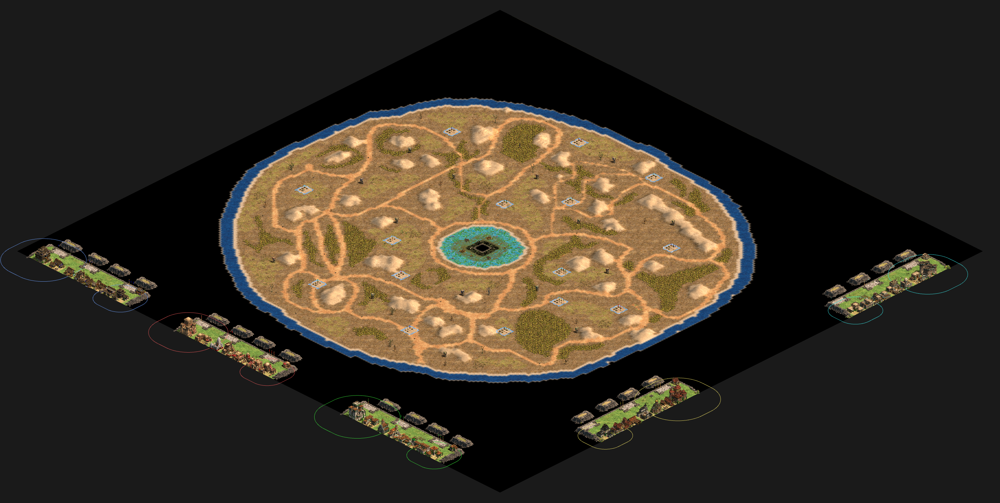

# Map Control #
## llama 2 ##

- 4 playerss
- control llamas for income in a bit
## 4p-map-control ##

- 4 players
- water buffalo control points
## dock flower ##

- 5 players
- docks are control points
- control enough docks for long enough and get an endless supply of units
- start with an outpost accross the map
- map is too croweded (docks-2-1 is better)
## docks-2-1 ##

- 5 players
- docks are control points
- control enough docks for long enough and get an endless supply of units
- start with an outpost accross the map
## p3-docks ##

- 3 players
- docks are control points
- pop cap 50
- villagers start scattered
- you can build town centers in the dark age
## p4_collect_carts ##

- 4 players
- destory endlessly spawning buildings to get carts
- collect n carts, get a free wonder
- off-map ram powered unit production
## p4-another-map-control ##

- 4 players
- safe economy
- control points
## p4-rams-llama ##

- 4 palyers
- off-map ram powered unit production
- control points give money(?)
- collect relic carts to win(?)
## p4-rams-llama-3 ##

- 4 palyers
- off-map ram powered unit production
- control points give money(?)
- collect relic cars to win(?)
# Nomad #
## 3-nomad-again ##

- 3 players
- large map with sparce resources
- resources are stacked (like 10 tress on one square) to limit the number of villagers you can gather with
- buildings are cheap, quick to build, build units quickly, weak, and slowly die
- you start with 2 bands of villagers
## 3-nomad-conquest-only-farms ##

- 3 players
- you can't build farms but there are a lot on the map
- villagers start scattered 
# Other #
## p3-normal-1-1 ##

- 3 players
## 4p-really-big-map ##

- 4 player
- wow this map is big
- empty too, your base will need to be spread out
## 5 sheep ##

- 5 players
- sheep spawn in the middle
- bring n sheep home to win
- no economy
## 550 ##

- 4 player (2v2)
- one player on each side has 500 pop and is stuck in the dark age
- one player on each side has 50 pop
## bb ##

- 2 player
## inertia_tiny2_v005 ##

- 4 players
- destory buildings for money
- control obelisks for income 
- made by toteos
## p2-war-3 ##

- 2 players
- destroy 2 enemy castles to win 
- designed to be played co-op
## vills-appear ##

- 3 players
- you can't build villagers
- villagers appear randomly around the map
## x_v001 ##

- 3 players
- you have 3 rams that each spawn a single unit type
- the unit types depend on your color
- cross the lake and return to win
## x_v003 ##

- 8 players
- you have 3 rams that each spawn a single unit type
- the unit types depend on your color
- cross the lake and return to win
## stone race ##

- be the first to mine your patch of stone to win
- 100 pop limit
- start in castle age
- bases have abnormally strong walls and towers
## berry wars ##

- 4 v 4
- harvest berries to win
- no econ
- played in rounds
- first team to win 3 rounds wins
- players 1 and 2 get stone
- players 3 and 4 get free villigers
## win fights ##

- 1 v 1 v 1 v 1
- steel a cow from each other player to win
- off map production
- our army spawns 